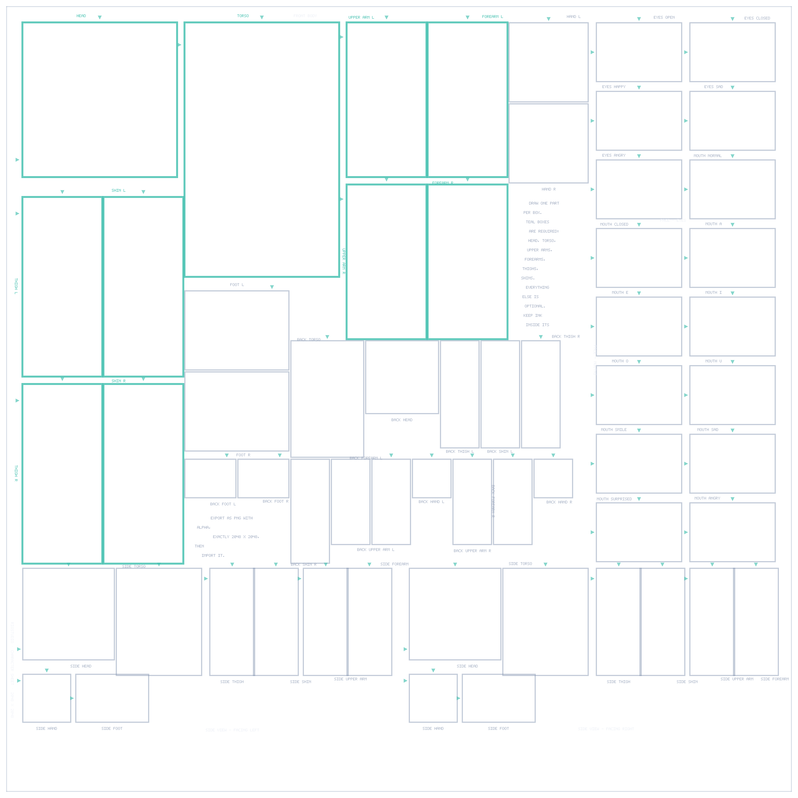
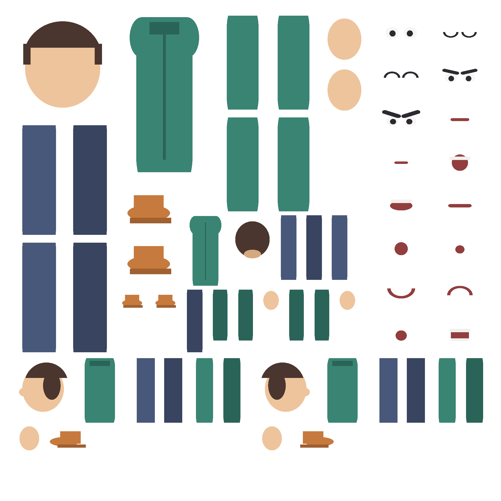

# RigStudio V3 — draw a sheet, get a rigged, animated character (native Android)

RigStudio turns **one 2048×2048 transparent PNG** — the *Character Sheet* — into a fully rigged 2D
character that plays **18 built-in animations** and exports them as **MP4 video**, entirely on the
device. No AI, no cloud, no login, no subscription, no network permission: the app is
airplane-mode-first by design.

The pipeline is deterministic and fixed-coordinate: every body part lives in a named slot at an
exact rectangle on the sheet, so extraction is pixel analysis (alpha + bounding box), never
guesswork.

<p align="center">
  
</p>
<p align="center"><em>The bundled blank template, rendered by <code>tools/render_template.py</code>
from the same solved layout the app draws (<code>tools/layout.json</code>).</em></p>

---

## How it works

```
 Character Sheet PNG (2048×2048, RGBA)
   │  1. validate   size, alpha channel, required front slots non-empty
   │  2. extract    crop each of the 60 named slots, trim transparent margins
   │  3. rig        bones Root→Torso→Head/Arms/Legs, pivots per spec, z-order rules
   │  4. animate    18 clips as pure keyframe data (deterministic, loopable)
   │  5. render     offscreen Canvas → preview Surface or export frames
   └─ 6. export     MediaCodec H.264 → MediaMuxer MP4 (or PNG sequence), validated afterwards
```

* **Extraction** reads only what is inside each slot rectangle. Empty-slot detection is
  alpha/bounding-box analysis; nothing is segmented, traced or "understood".
* **Rig** pivots: head 50%/90%, torso 50%/8%, limbs 50%/8%, feet 85%/50%. Bone limits are enforced
  per joint; mirrored views negate rotations instead of re-authoring clips.
* **Views**: front (always), side-left / side-right (8 parts each, optional, mirrorable), back
  (14 parts, optional). A missing view is *disabled and labelled*, never faked.
* **Face system**: 5 eye + 11 mouth slots auto-attach to the head; Talk cycles mouths
  closed → A → E → O → closed deterministically.
* **Export**: MP4 (H.264) is the primary format — 720p/1080p, 24/30/60 fps (default 1080p30),
  optional local audio track, encoded with `MediaCodec` + `MediaMuxer` from offscreen renders.
  No screen recording, no FFmpeg, no GIF-as-primary. Every file is re-opened and validated
  (exists, size > 0, tracks, duration, dimensions, fps) before Save/Share/Open is offered.

## The 18 animations

Idle · Stand · Walk · Run · Talk · Wave · Sit · Sleep · Jump · Walk+Talk ·
Side Walk · Side Run · Side Talk · Look Back · Happy · Sad · Angry · Surprised

Clips are data (`core/.../anim/`): keyframed bone tracks with per-joint limits, looping semantics
and dynamic z-order (e.g. legs swap in front of / behind the torso while walking).

## Repository layout

| Path | What it is |
| --- | --- |
| `core/` | Pure Kotlin engine: template geometry, extraction, rig, animation, draw-lists, export models, JSON, project persistence. No Android dependencies; 161 unit tests. |
| `app/` | Native Android app: Compose UI, ViewModels, Canvas stage renderer, `MediaCodec` MP4 writer, project storage, template & sample-character art. |
| `tools/` | Offline verification: slot/layout dumpers, reference PNG renderer, sheet checker, synthetic-sheet painter, one-command `verify_all.sh`. |
| `docs/assets/` | The rendered blank character sheet (generated, committed for review & CI drift checks). |
| `legacy/v2-flutter/` | The previous Flutter implementation (V1/V2), kept for reference only. Superseded entirely by V3. |

### Module map (app)

`ui/` Compose screens & theme · `editor/` ViewModels + playback state · `render/` stage renderer,
`StageView`, thumbnails · `export/` YUV conversion, audio source, MP4 writer, export runner ·
`pipeline/` sheet import & validation · `art/` template + sample character · `data/` project store.

## Building

Android Studio (Ladybug or newer) or:

```bash
./gradlew :app:assembleDebug      # JDK 17 + Android SDK 35
```

The app declares **no permissions** in its manifest; media access goes through the system picker
and SAF, and projects live in app-private storage (`projects/<id>/…`).

## CI

`tools/ci/github-workflow.yml` is the GitHub Actions workflow for V3 (verify_all --drift, then a
Gradle debug APK). It is kept in `tools/` because this session's GitHub token is not allowed to
modify `.github/workflows/`; copy it into place once that permission is available:

```bash
cp tools/ci/github-workflow.yml .github/workflows/ci.yml
```

Until then the repository still carries the archived Flutter workflow, which no longer matches the
tree and will report failures on V3 branches.

## Verifying without a phone

Everything below runs offline with a JDK, `kotlinc` and stock Python 3:

```bash
bash tools/verify_all.sh          # 8 steps, all green == pipeline holds together
bash tools/verify_all.sh --drift  # + fail if committed sheet artefacts are stale
```

| Step | Proves |
| --- | --- |
| `run_core_tests.sh` | 161 engine tests: template, layout, extraction, rig, draw-lists, animation, playback, export, persistence |
| `check_app.sh` | `:core` and all non-Compose `:app` sources compile against `tools/android-stubs` (mirrored Android API) |
| `dump_slots.sh` | Slot geometry (`slots.json`) and the solved guide-ink layout (`layout.json`) straight from the Kotlin template |
| `render_template.py` | Reference render of the blank sheet from `layout.json` (5×7 bitmap font, no deps) |
| `sheet_check.py --template` | **The invariant: zero guide ink inside any slot rectangle**, checked pixel-by-pixel |
| `sheet_check.py` | Any sheet PNG: riggability, available views, mirror offer, expressions/mouths, stray-ink warnings |
| `make_test_sheet.py` | Synthetic filled sheets (front / front+side / full) so the analyser is tested end-to-end |
| `make_sample_character.py` | Paints the bundled sample character (all 60 slots, 5 expressions, 11 mouths) |
| `render_previews.sh` | Runs a sheet through extract -> rig -> all 18 clips and rasterises real frames on the JVM (filmstrips + contact sheet); fails on any empty frame |

`render_previews.sh` is the offline stand-in for a phone: it feeds a sheet PNG through the very
same core code the app uses - `SheetProcessor`, `RigBuilder`, `ForwardKinematics`,
`PuppetComposer` - and blits the resulting draw lists with a naive JVM rasteriser, so every
(view, clip) pair is proven to produce framed, non-empty animation frames without an Android SDK.

<p align="center">
  
</p>
<p align="center"><em>The bundled sample character sheet: original placeholder artwork in all 60
slots, used by the offline checks and available in-app for instant testing.</em></p>

The layout of guide ink (labels, outlines, pivot ticks) is solved as pure geometry in
`core/.../template/TemplateLayout.kt` and unit-tested: every slot is labelled, no text overlaps
text or a pivot tick, and nothing is ever drawn inside a slot — because ink inside a slot would be
extracted as artwork on import.

### Character Sheet rules (short version)

* 2048×2048 RGBA PNG; 60 slots: 24 front-body (exact spec coordinates), 16 face (5 eyes, 11 mouths),
  16 side (8 left + 8 right), 14 back.
* Required: the 10 front-body parts that make a riggable character. Everything else degrades to a
  warning and a disabled view/animation.
* Complete left profile + empty right profile ⇒ optional **Mirror Side View** derives the right side.
* Artwork outside every slot is ignored (with a warning showing how much stray ink was found).

## Guarantees (and explicit non-goals)

* Offline: no `INTERNET` permission, no analytics, no cloud sync, no accounts, no payments.
* Deterministic: same sheet ⇒ same rig, same frames, same MP4, on any device.
* No AI/ML auto-rigging, no manual skeleton/lasso editing, no fake side/back generation,
  no FFmpeg, no screen-record export.
* Core engine and all 18 animations are free; nothing is gated behind payment.

## Legacy

`legacy/v2-flutter/` contains the earlier Flutter app (chroma-key import, GIF previews). It is
archived reference material: V3 replaces its architecture (fixed-slot extraction instead of
auto-segmentation, MP4 instead of GIF-primary) and shares no code or assets with it.

## License

See [LICENSE](LICENSE).
